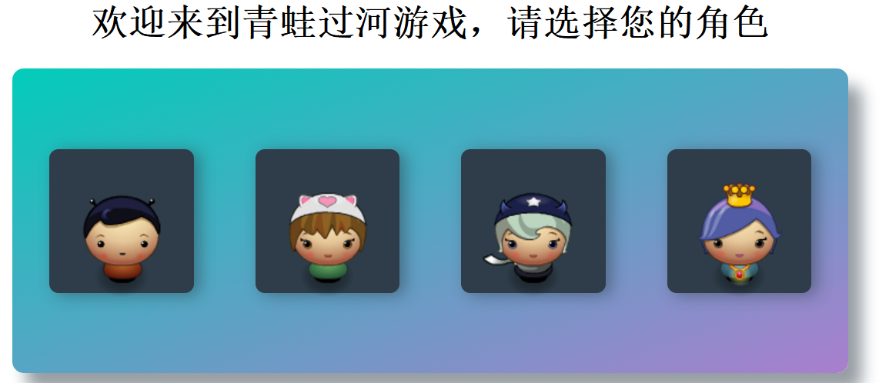
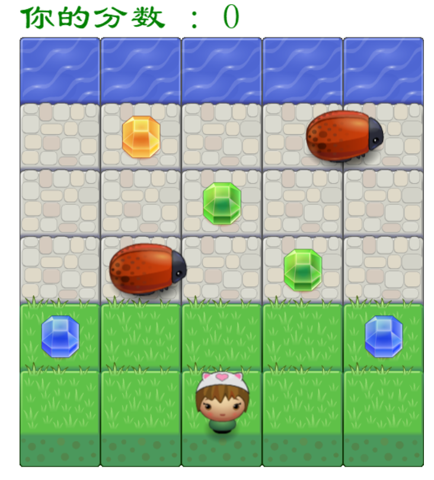
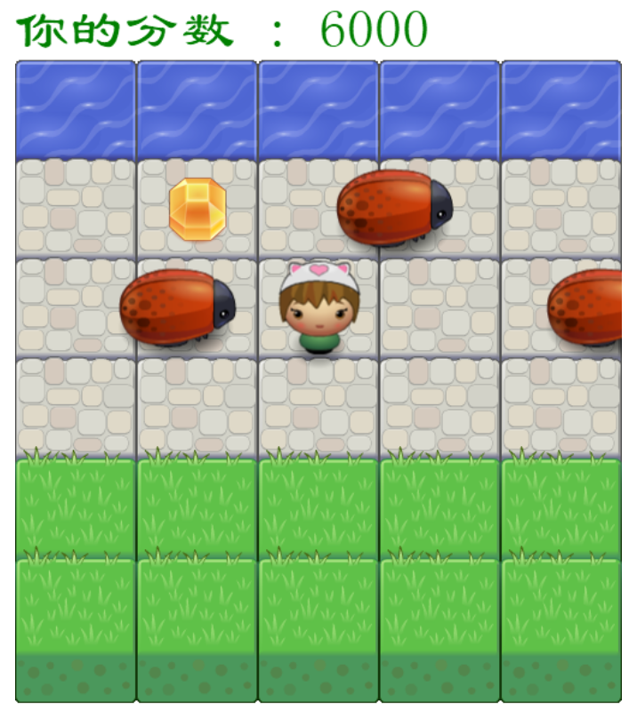
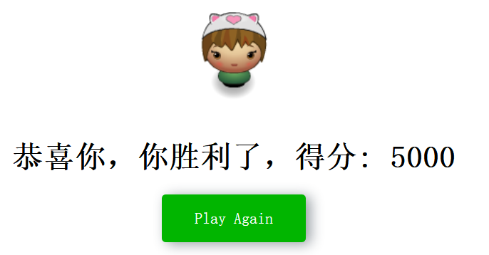

街机游戏克隆项目 -- 青蛙过街 
===============================

## 青蛙游戏描述

在这个游戏中你有一个玩家和甲虫。 玩家的目标是到达水面，而不会碰撞任何一个敌人。 玩家可以向左，向右，向上和向下移动。 敌人在现场的铺砌块部分以不同的速度移动。 一旦玩家与敌人发生冲突，游戏将被重置，玩家将移回起始方块。 一旦玩家到达水面，游戏就赢了。在到达水面的过程中，可以想办法拿到砖石，会有加分。

## 游戏过程

### 1.选择角色

玩家选择：允许用户在开始游戏之前选择玩家角色的图像, 一共有四个角色供你选择。

### 2.冲向河边，顺便可以取砖石加分

进入游戏后，地图如下：

拿到蓝砖石，加1000分；拿到绿砖石，加2000分；拿到橙色砖石，加5000分。

但是如果碰到敌人，就会被打回原地，并且惩罚5000分，且已经拿过的砖石不会再出现

加油

### 3.游戏胜利

这是游戏胜利的通关画面

